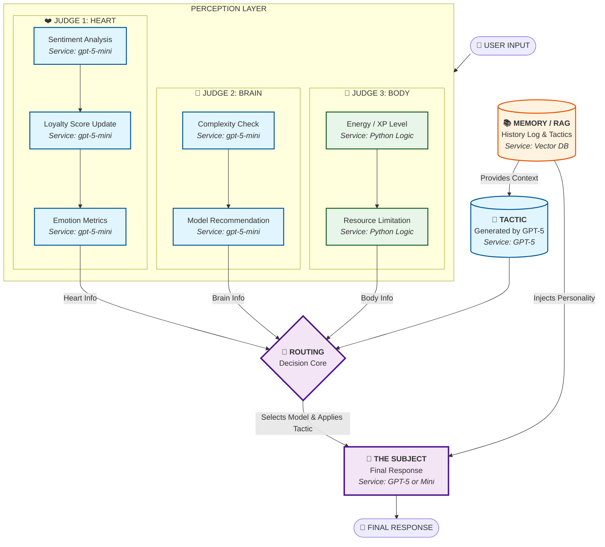

# 🧬 The Subject Entity
### Backboard.io x McHacks 13 Challenge Entry

> *"Is AI subjectivity possible without true consciousness? Perhaps the perfect imitation of subjectivity is the first step toward the real thing."*

**The Subject Entity** is not a chatbot. It is a persistent digital entity that remembers your relationship, feels emotions, and manages its own energy. Built entirely on **Backboard.io**.

---

<!-- ВСТАВИТЬ ВИДЕО СЮДА -->
[](https://youtu.be/s02iThzdXwA)


> *"Is AI subjectivity possible without true consciousness? Perhaps the perfect imitation of subjectivity is the first step toward the real thing."*

## 🚀 Key Features

This project demonstrates advanced usage of the Backboard API:

*   **🧠 Persistent Emotional Memory (RAG):** The system maintains a "History Log" in the Vector Database. It remembers not just *what* you said, but *how* you made it feel (Loyalty Score).
*   **🔀 Dynamic Routing (Heart & Brain):** The system switches between models (`gpt-5` vs `gpt-5-mini`) based on **User Loyalty** and **Task Complexity**.
*   **⚖️ The Three Judges Architecture:**
    *   **❤️ The Heart:** Analyzes sentiment (AI Model).
    *   **🧠 The Brain:** Analyzes complexity (AI Model).
    *   **🔋 The Body:** Monitors energy/XP limits (Python Logic).
*   **⚔️ Tactical Adaptation:** Before every session, the AI reads the RAG history to formulate a specific behavioral **Tactic** for the user.

---

## 📂 Project Structure

| File | Description |
| :--- | :--- |
| **`main.py`** | **The Core System.** Runs the entity, the judges, and the conversation loop. |
| **`check_server.py`** | **Cloud Inspector.** Connects to the Backboard API to view the raw RAG memory logs stored in the cloud. Proof of persistence. |
| **`reset_memory.py`** | **System Wipe.** Deletes all memories and resets the entity to a "Tabula Rasa" state. |

---

## 🛠️ Installation & Setup

1.  **Clone the repository:**
    ```bash
    git clone https://github.com/anopochkin/The_Subject_Entity.git
    cd The_Subject_Entity
    ```

2.  **Install dependencies:**
    ```bash
    pip install requests
    pip install backboard-sdk
    ```

3.  **Configure API Key:**
    Open `main.py` (and other scripts) and insert your Backboard API Key:
    ```python
    API_KEY = "your_backboard_key_here"
    ```

---

## 🎮 How to Run

### 1. Start the Entity
Run the main script to begin the interaction.
```bash
python main.py
```
*   **Meeting #1:** The bot starts neutral (50% Loyalty).
*   **Try this:** Insult the bot or ask for complex tasks. Watch the **Heart** lower your score and the **Router** switch to the cheap model.
*   **Fatigue:** If you talk too much, the **Body** will deplete XP, and the bot will fall asleep.

### 2. Verify Persistence (The "Magic" Moment)
Close `main.py` and run the inspector to see what the AI "remembers" about you in the cloud.
```bash
python check_server.py
```
*   You will see the raw **History Log** and **Loyalty Score** fetched directly from Backboard's Vector DB.

### 3. Reset the System
To start fresh with a new personality and zero memory:
```bash
python reset_memory.py
```

---

## 🏗️ Architecture Diagram



---

## 🏆 Hackathon Criteria Checklist

- [x] **Technical Implementation:** Uses Assistants API, Threads, Documents (RAG), and Models.
- [x] **Memory:** Implements "Stateful Memory" where variables (Loyalty) are stored as semantic vectors.
- [x] **Routing:** Logic switches between `gpt-5` and `gpt-5-mini` based on context.
- [x] **Innovation:** Simulates a living entity with fatigue and emotions.

---

*Built for McHacks 13 x Backboard.io Challenge.*
